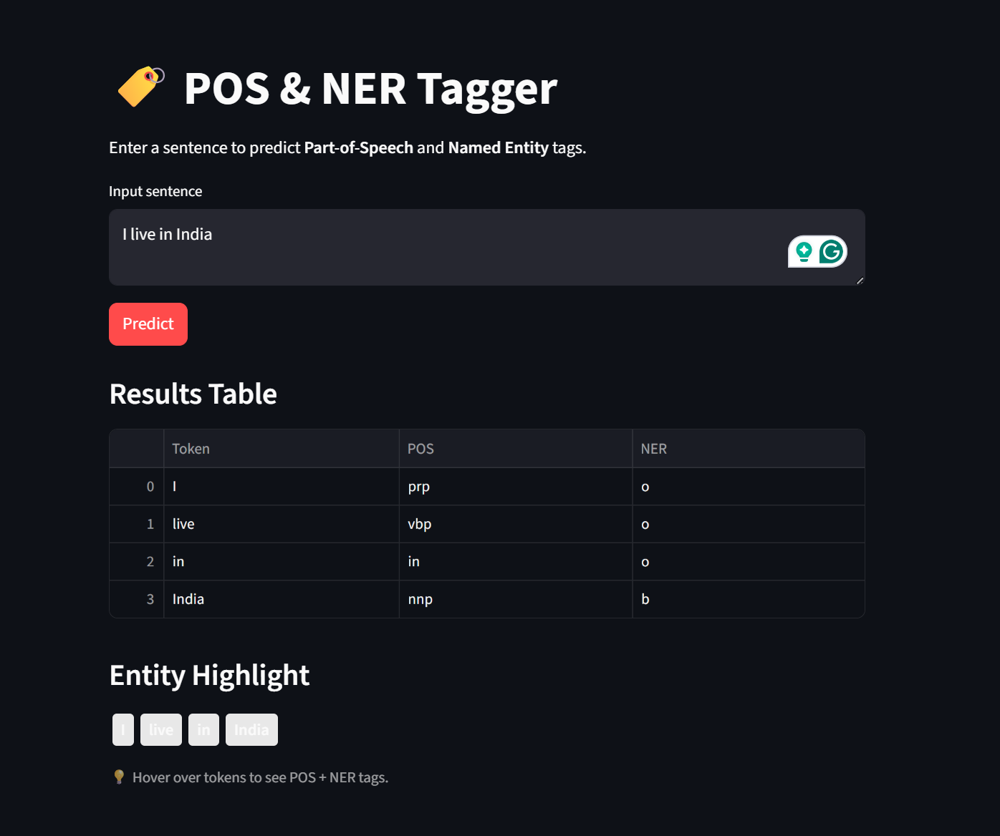

# POS Tagging and Named Entity Recognition (NER)

A deep learning model that simultaneously predicts **Part-of-Speech (POS) tags** 
and **Named Entity Recognition (NER)** labels for English text using a 
Bidirectional LSTM architecture.

---

## Demo


---

## Overview
This project builds a multi-output BiLSTM model trained on the NLP NER dataset
that can identify:
- **POS Tags** — grammatical role of each word (Noun, Verb, Adjective etc.)
  using the Penn Treebank tagset (42 tags)
- **NER Labels** — named entities in text (Person, Organization, Location etc.)
  using IOB2 format (17 entity classes)

---

## Model Architecture
```
Input Sentence
      ↓
Embedding Layer (vocab_size × 50)
      ↓
Bidirectional LSTM (128 units)
      ↓
    /   \
   ↓     ↓
POS Head  NER Head
(Dense)   (Dense)
   ↓         ↓
POS Tags   NER Tags
```

## Dataset
- **Name:** CoNLL 2003 NER Dataset
- **Format:** CSV with columns — Sentence #, Word, POS, Tag
- **POS Tags:** 42 Penn Treebank tags (NN, VB, JJ, NNP etc.)
- **NER Tags:** 17 IOB2 tags (B-geo, I-per, B-org etc.)

---

## NER Entity Classes
| Tag | Description |
|-----|-------------|
| B/I-geo | Geographical Entity |
| B/I-gpe | Geopolitical Entity |
| B/I-per | Person |
| B/I-org | Organization |
| B/I-tim | Time Expression |
| B/I-art | Artifact |
| B/I-eve | Event |
| B/I-nat | Natural Phenomenon |
| O | Not a named entity |

---

## Results
| Metric | Score |
|--------|-------|
| POS Accuracy | 87% |
| NER Accuracy | 87% |

---

## Project Structure
```
POS_NER_Prediction/
│
├── pos_ner_model.py        # Model training script
├── app.py                  # Streamlit frontend
├── NER_dataset.csv         # Dataset
├── pos_ner_model.h5        # Saved model weights
├── tokenizer_sen.pkl       # Sentence tokenizer
├── tokenizer_pos.pkl       # POS tokenizer
├── tokenizer_ner.pkl       # NER tokenizer
├── max_len.pkl             # Max sequence length
├── requirements.txt        # Dependencies
└── README.md
```

## Installation

1. Clone the repository
```bash
git clone https://github.com/yourusername/pos-ner-prediction.git
cd pos-ner-prediction
```

2. Install dependencies
```bash
pip install -r requirements.txt
```

3. Run the Streamlit app
```bash
streamlit run app.py
```

---

## Requirements
```
tensorflow
numpy
pandas
streamlit
scikit-learn
```
 
---
 
## Usage
Enter any English sentence in the Streamlit app and the model will return each word annotated with its POS tag and NER label.
 
**Example:**
```
Input: "Apple is looking at buying U.K. startup"
 
Output:
Word        POS     NER
----------- ------- -------
Apple       NNP     B-org
is          VBZ     O
looking     VBG     O
at          IN      O
buying      VBG     O
U.K.        NNP     B-geo
startup     NN      O
```
 
---

## Training
To retrain the model from scratch:
```bash
python pos_ner_model.py
```

---

## Tech Stack
- **Language:** Python
- **Deep Learning:** TensorFlow / Keras
- **Architecture:** Bidirectional LSTM
- **Frontend:** Streamlit
- **Dataset:** CoNLL NER Dataset
